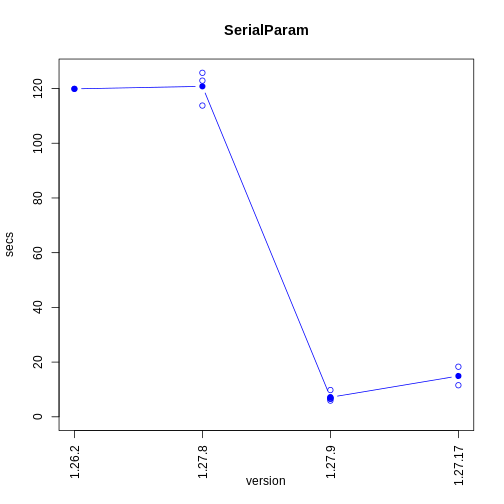

# Introduction
This is a benchmark for the popular parallel packages `parallel`, `foreach` and `BiocParallel`. The source code for generating the benchmark result is available at the branch `source`.


# Overhead benchmark
This benchmark measures the overhead of the parallel functions. The function being evaluated is equivalent to

```r
lapply(1:n, function(x) runif(1))
```
where n=100000. All parallel functions use its default setting. Below is the table for the time consumption. 16 workers are used for each cluster(Note that the host may not have 16 CPUs)

|   |source             |package      |backend        |version |call      | time(sec)| performance relative to baseline(%)|
|:--|:------------------|:------------|:--------------|:-------|:---------|---------:|-----------------------------------:|
|1  |r-base             |parallel     |socket         |4.1.1   |parLapply |     0.469|                              100.00|
|5  |r-base             |foreach      |doParallel     |1.0.16  |foreach   |    59.395|                                0.79|
|6  |r-base             |base         |NA             |4.1.1   |lapply    |     0.804|                               58.33|
|2  |BioConductor-devel |BiocParallel |SerialParam    |1.27.9  |bplapply  |     5.940|                                7.90|
|3  |BioConductor-devel |BiocParallel |SnowParam      |1.27.9  |bplapply  |     5.487|                                8.55|
|4  |BioConductor-devel |BiocParallel |MulticoreParam |1.27.9  |bplapply  |    82.582|                                0.57|


# CPU intensive benchmark
The function being evaluated is equivalent to

```r
lapply(1:n, function(x) {
    m <- 5000L
    value <- 0
    for(i in 1:m){
        value <- value + sum(sample(1:m, m))
    }
    value
})
```
where n=100. All parallel functions use its default setting.


|   |source             |package      |backend        |version |call      | time(sec)| performance relative to baseline(%)|
|:--|:------------------|:------------|:--------------|:-------|:---------|---------:|-----------------------------------:|
|1  |r-base             |parallel     |socket         |4.1.1   |parLapply |    75.076|                              100.00|
|5  |r-base             |foreach      |doParallel     |1.0.16  |foreach   |   113.983|                               65.87|
|6  |r-base             |base         |NA             |4.1.1   |lapply    |   143.416|                               52.35|
|2  |BioConductor-devel |BiocParallel |SerialParam    |1.27.9  |bplapply  |   170.162|                               44.12|
|3  |BioConductor-devel |BiocParallel |SnowParam      |1.27.9  |bplapply  |    99.379|                               75.55|
|4  |BioConductor-devel |BiocParallel |MulticoreParam |1.27.9  |bplapply  |    93.421|                               80.36|

# BiocParallel benchmark history
## Overhead


```r
files <- list.files("../results/history", full.names = TRUE)
overheadFiles <- files[grepl(".+BiocParallel-overhead-", files)]
overHeadData <- readFileData(overheadFiles)
for(backend in unique(overHeadData$backend)){
curData <- overHeadData[overHeadData$backend == backend,]
makePlot(curData, title = backend)
}
```



## CPU intensive

```r
cpuFiles <- files[grepl(".+BiocParallel-cpu-", files)]
cpuData <- readFileData(cpuFiles)
for(backend in unique(cpuData$backend)){
curData <- cpuData[cpuData$backend == backend,]
makePlot(curData, title = backend)
}
```


## Host machine specification

```r
benchmarkme::get_cpu()
#> $vendor_id
#> [1] "GenuineIntel"
#> 
#> $model_name
#> [1] "Intel(R) Xeon(R) Platinum 8272CL CPU @ 2.60GHz"
#> 
#> $no_of_cores
#> [1] 2
benchmarkme::get_ram()
#> 7.29 GB
```

